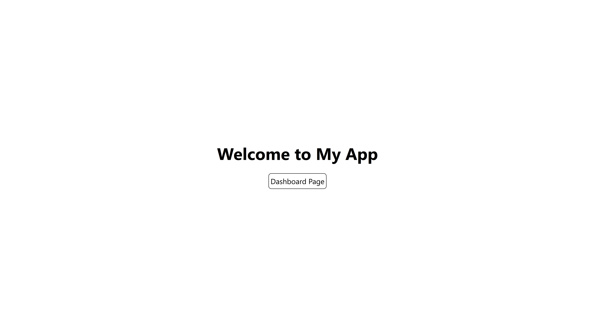
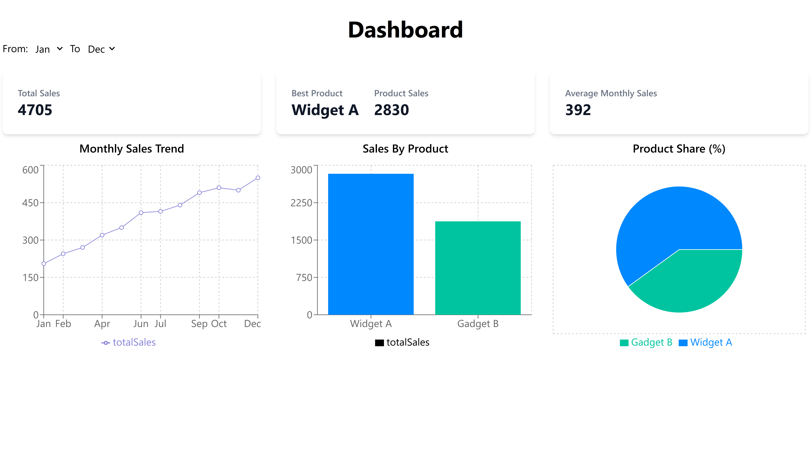

# Next.js Dashboard with MongoDB
An interactive analytics dashboard built with **Next.js App Router, MongoDB**, and  **Recharts.**
It visualizes sales data with **line, bar, and pie charts,** provides key metrics like **total sales, best product, and average monthly sales**, and supports **dynamic filtering by month** using query parameters.

## 🚀 Features
- Interactive dashboard with charts (Line, Bar, Pie)  
- Live data fetching using SWR  
- API routes powered by MongoDB  
- Month filter with query params  
- Summary cards (Total, Best Product, Average Sales)  

## 🛠️ Tech Stack
- Next.js (App Router)  
- MongoDB  
- SWR  
- Recharts   
- Tailwind CSS  

## 📸 Screenshot
### Home Page

### Dashboard Page
  

## ⭐ Future Enhancements
- Year filter    
- Auth & role-based dashboards  
- More KPIs (growth rate, comparisons)  